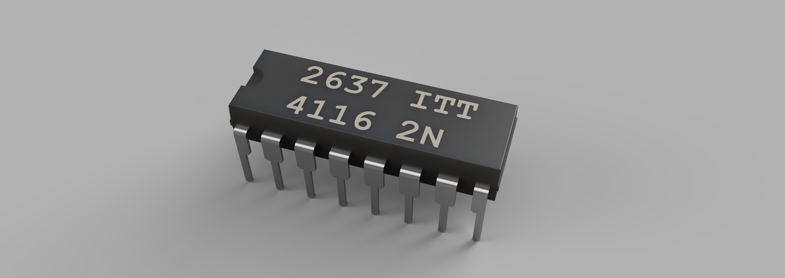
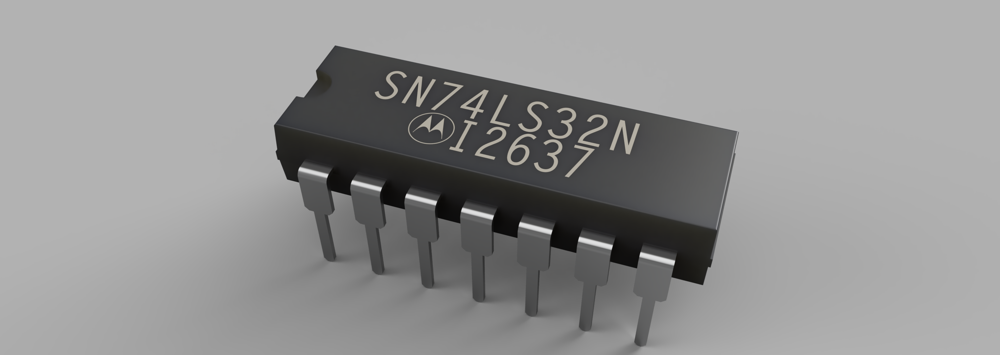
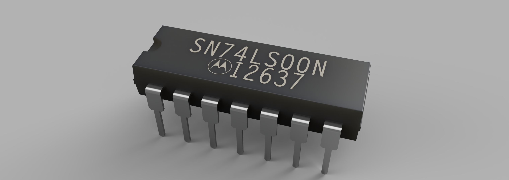
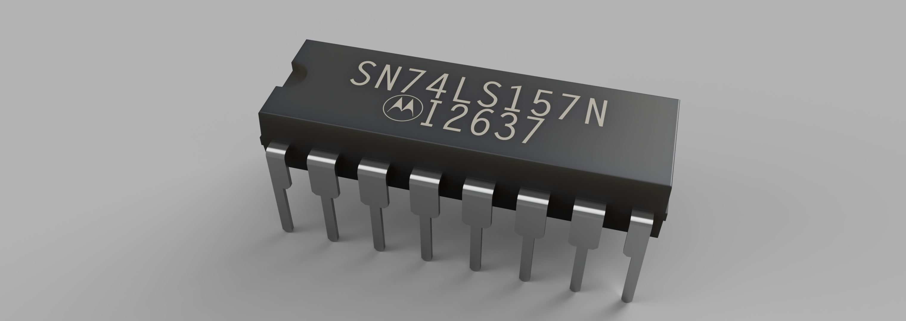
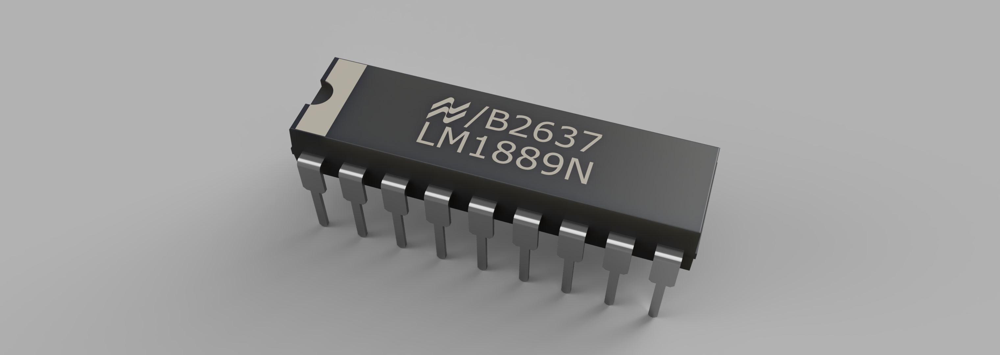
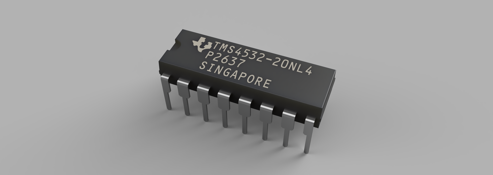

  

# ZX Spectrum 48K Component Models

A collection of recreated 3D component models and PCB footprints for the
**Sinclair ZX Spectrum 48K**, intended for PCB design, restoration,
documentation and preservation work.

These models represent original or period-correct components that can be
difficult to find as ready-made 3D models or accurate PCB footprints.

This project is part of the wider
**[PCB Design & Component Library](https://github.com/bljakk-alt/PCB-Design)**.

## File formats

Each component folder contains the available model files and a rendered preview.

- **OBJ + MTL** — provided together for **EasyEDA** use.
  - The OBJ contains the geometry.
  - The MTL contains the material / colour information.
  - Keep the OBJ and MTL together when importing.
- **STEP** — generic CAD format.
  - Suitable for **KiCad** 3D PCB views.
  - Can also be used in Fusion, FreeCAD and other STEP-compatible CAD/EDA software.

## Footprints

If footprints are available, they are located in the respective component
subfolder.

Each component may contain an additional `footprint` subfolder with the JSON
file exported directly from EasyEDA.

Each footprint may include:

- PCB layers
- Silkscreen
- Component outline / shape
- Pad and pin shapes
- Pin numbering
- Additional component-specific information where required

# ZX Spectrum-specific designs

## LM7805 with Heatsink

LM7805 regulator assembly with ZX Spectrum-style heatsink and mounting hardware.

---

## RF MOD Astec 1233 E36

Astec UM1233 / E36 RF modulator enclosure recreation.

---

## ROM

**Footprint:** [DIP28W-14.10X36.75-RS15.24-P2.54](https://github.com/bljakk-alt/PCB-Design/tree/main/DIP28W-14.10X36.75-RS15.24-P2.54/footprint)

Hitachi HN613128P ROM IC recreation.

---

## ULA

**Footprint:** [DIP40-14.10X52.00-RS15.24-P2.54](https://github.com/bljakk-alt/PCB-Design/tree/main/DIP40-14.10X52.00-RS15.24-P2.54/footprint)

Ferranti ULA 6C001E-7 IC recreation.

---

## Z80

**Footprint:** [DIP40-14.10X52.00-RS15.24-P2.54](https://github.com/bljakk-alt/PCB-Design/tree/main/DIP40-14.10X52.00-RS15.24-P2.54/footprint)

NEC D780C-1 Z80 CPU, 8308P8 recreation.

---

## ITT 4116

ITT 4116 16K × 1 dynamic RAM IC recreation.

**Footprint:** [DIP16-6.40x19.25-RS7.62-P2.54](https://github.com/bljakk-alt/PCB-Design/tree/main/DIP16-6.40x19.25-RS7.62-P2.54/footprint)

---

## Motorola SN74532N

Motorola 14-pin logic IC recreation.

**Footprint:** [DIP14-6.40x19.25-RS7.62-P2.54](https://github.com/bljakk-alt/PCB-Design/tree/main/DIP14-6.40x19.25-RS7.62-P2.54/footprint)

---

## Motorola SN74LS00N

Motorola SN74LS00N 14-pin logic IC recreation.

**Footprint:** [DIP14-6.40x19.25-RS7.62-P2.54](https://github.com/bljakk-alt/PCB-Design/tree/main/DIP14-6.40x19.25-RS7.62-P2.54/footprint)

---

## Motorola SN74LS157N

Motorola SN74LS157N 16-pin logic IC recreation.

**Footprint:** [DIP16-6.40x19.25-RS7.62-P2.54](https://github.com/bljakk-alt/PCB-Design/tree/main/DIP16-6.40x19.25-RS7.62-P2.54/footprint)

---

## National Semiconductor LM1889N

National Semiconductor LM1889N 18-pin TV video modulator IC recreation.

**Footprint:** [DIP18-6.40X22.86-RS7.62-P2.54](https://github.com/bljakk-alt/PCB-Design/tree/main/DIP18-6.40X22.86-RS7.62-P2.54/footprint)

---

## Texas Instruments TMS4532

Texas Instruments TMS4532 32K × 1 dynamic RAM IC recreation.

**Footprint:** [DIP16-6.40x19.25-RS7.62-P2.54](https://github.com/bljakk-alt/PCB-Design/tree/main/DIP16-6.40x19.25-RS7.62-P2.54/footprint)

---

## ZX Spectrum Speaker 40 Ω — 23 mm

ZX Spectrum 40 Ω speaker recreation, 23 mm diameter.

---

## ZX Spectrum Speaker 200 Ω — 27 mm

ZX Spectrum 200 Ω speaker recreation, 27 mm diameter.

# Shared PCB components used by the ZX Spectrum

The following components are used by this project but are maintained in the
general **[PCB-Design](https://github.com/bljakk-alt/PCB-Design)** repository
so they can also be reused by other hardware projects.

## Audio Jack — 3 Pin

[View component](https://github.com/bljakk-alt/PCB-Design/tree/main/AUDIO_JACK_3PIN)

ZX Spectrum EAR/MIC 3-pin audio connector recreation.

---

## Axial Capacitor — Ø6.3 × 12.0 mm

[View component](https://github.com/bljakk-alt/PCB-Design/tree/main/CAP-TH_BD6.3-L12.0-P20.32-D0.6)

Axial through-hole capacitor with Ø6.3 mm body, 12.0 mm body length,
20.32 mm PCB mounting pitch and Ø0.6 mm leads.

---

## Coil L1

[View component](https://github.com/bljakk-alt/PCB-Design/tree/main/COIL_L1)

ZX Spectrum L1 coil / transformer recreation.

---

## DO-35 / BA157

[View component](https://github.com/bljakk-alt/PCB-Design/tree/main/DO-35_P12.70_BA157)

DO-35 axial diode model with 12.70 mm PCB mounting pitch.

---

## TE Connectivity / AMP 520315-5 — 5 Pin

[View component](https://github.com/bljakk-alt/PCB-Design/tree/main/CONN_TH_5P_P2.54_520315-5)

5-pin through-hole keyboard connector recreation.

---

## TE Connectivity / AMP 520315-8 — 8 Pin

[View component](https://github.com/bljakk-alt/PCB-Design/tree/main/CONN_TH_8P_P2.54_520315-8)

8-pin through-hole keyboard connector recreation.

---

## PCB Jumper

[View component](https://github.com/bljakk-alt/PCB-Design/tree/main/JUMPER-TH_P7.80-D0.53)

Through-hole PCB wire-link / jumper model.

## Usage

For **EasyEDA**, use the **OBJ + MTL** files together. If they are distributed
as a ZIP archive, keep both files in the archive together so the material
reference remains available.

For **KiCad**, the **STEP** file is generally the most convenient choice and
can be assigned directly as the footprint's 3D model.

The STEP files are not tied to a specific EDA package and may also be used in
Fusion, FreeCAD and other CAD or PCB tools that support STEP.

## Related repository

General-purpose PCB components and 3D models used by this and other projects:

**[dee labs — PCB Design & Component Library](https://github.com/bljakk-alt/PCB-Design)**

## License

These models are licensed under the
**Creative Commons Attribution-NonCommercial 4.0 International License
(CC BY-NC 4.0)**.

They are free to use, share and modify for **non-commercial purposes**, with
attribution. **Commercial use requires separate written permission.**

See the full repository license: **[LICENSE.md](https://github.com/bljakk-alt/PCB-Design/blob/main/LICENSE.md)**.

## Notes

These are independently recreated 3D models intended for preservation, repair,
documentation and hobbyist PCB work.

Product names and trademarks belong to their respective owners.

More models may be added as the ZX Spectrum component library grows.