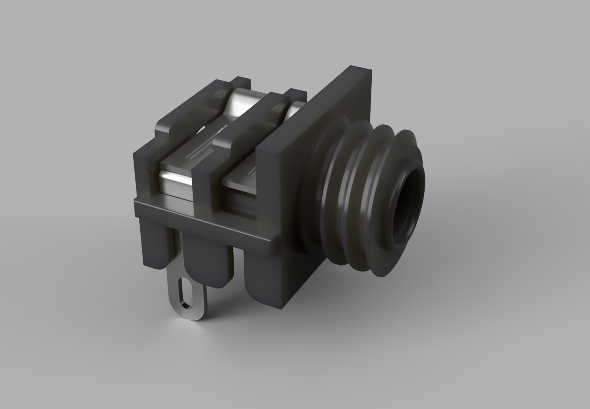
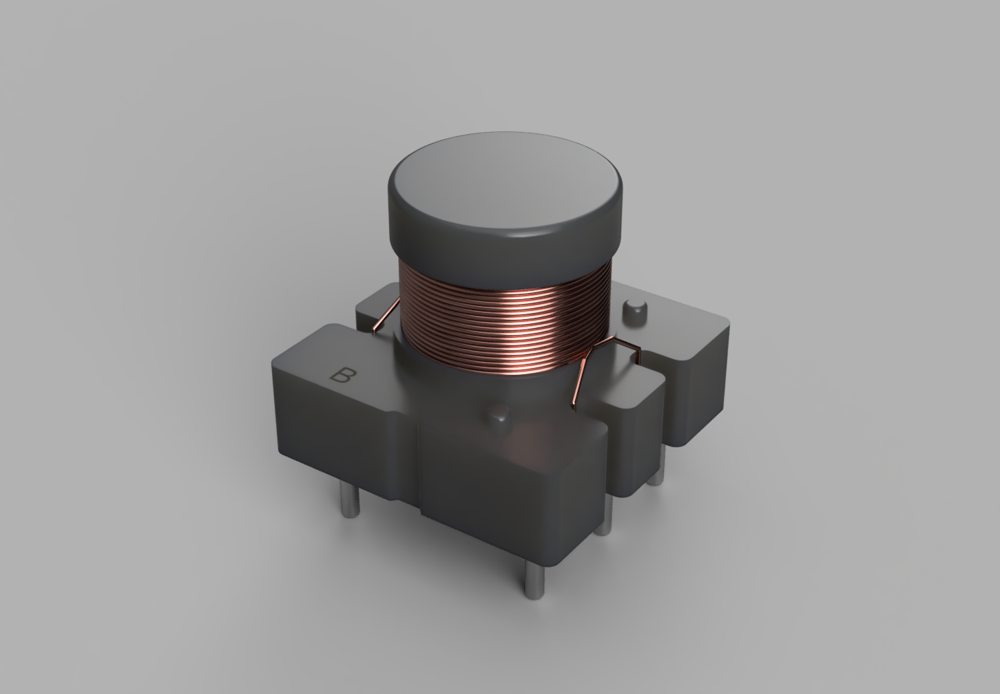
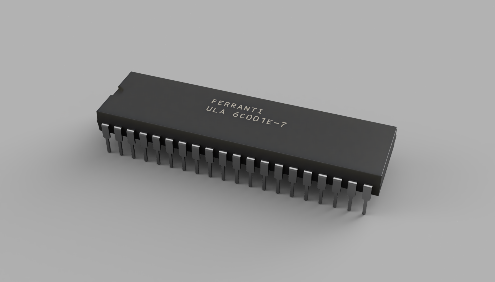

# ZX Spectrum 3D Component Models

A collection of recreated 3D component models for the **Sinclair ZX Spectrum**, intended for PCB design, restoration, documentation, and preservation work.

These models represent original or period-correct components that can be difficult to find as ready-made 3D models.

## File formats

Each component folder contains the available model files and a rendered preview.

- **OBJ + MTL** — provided together for **EasyEDA** use.
  - The OBJ contains the geometry.
  - The MTL contains the material / colour information.
  - Keep the OBJ and MTL together when importing.
- **STEP** — generic CAD format.
  - Suitable for **KiCad** 3D PCB views.
  - Can also be used in Fusion, FreeCAD, and other STEP-compatible CAD/EDA software.

## Footprints

If footprints are available, they are located in the respective component subfolder. Each component may contain an additional `footprint` subfolder with the JSON file exported directly from EasyEDA.

Each footprint includes the proper:

- PCB layers
- Silkscreen
- Component outline/shape
- Pad and pin shapes
- Pin numbering
- Additional component-specific information where required

## Current designs

### [AUDIO_JACK_3PIN](./AUDIO_JACK_3PIN/)

ZX Spectrum 3-pin EAR/MIC audio connector recreation.

---

### [CONN-TH_5P-P2.54_520315-5](./CONN_TH_5P_P2.54_520315-5/)

Recreated TE Connectivity / AMP 520315-5 style 5-pin keyboard connector.

---

### [CONN-TH_8P-P2.54_520315-8](./CONN_TH_8P_P2.54_520315-8/)

Recreated TE Connectivity / AMP 520315-8 style 8-pin keyboard connector.

---

### [COIL L1](./COIL_L1/))

ZX Spectrum L1 coil / transformer recreation.

---

### [LM7805 with Heatsink](./LM7805%20with%20Heatsink/)

LM7805 regulator assembly with ZX Spectrum-style heatsink and mounting hardware.

---

### [RF MOD Astec 1233 E36](./RF%20MOD%20Astec%201233%20E36/)

Astec 1233 E36 RF modulator enclosure recreation.

---

### [MICROSWITCH_OPEN_FRAME_SPRING_LEVER](./MICROSWITCH_OPEN_FRAME_SPRING_LEVER/)

Open-frame spring-lever microswitch recreation for retro joysticks.

---

### [ZX Spectrum Speaker 40ohm - 23mm](./ZX%20Spectrum%20Speaker%2040ohm/)

ZX Spectrum 40 Ω speaker recreation, 23mm diameter.

---

### [ZX Spectrum Speaker 200ohm 27mm](./ZX%20Spectrum%20Speaker%20200ohm/)

ZX Spectrum 200 Ω speaker recreation, 27mm diameter.

---

### [ROM](./ROM/)

Hitachi HN613128P ROM IC recreation.

---

### [ULA](./ULA/)

Ferranti ULA 6C001E-7 IC recreation.

---

### [Z80](./Z80/)

NEC D780C-1 Z80 CPU, 8308P8 recreation.

---

## Usage

For **EasyEDA**, use the **OBJ + MTL** files together. If they are distributed as a ZIP archive, keep both files in the archive together so the material reference remains available.

For **KiCad**, the **STEP** file is generally the most convenient choice and can be assigned directly as the footprint's 3D model.

The STEP files are not tied to a specific EDA package and may also be used in other CAD or PCB tools that support STEP.

## License

These models are licensed under the **Creative Commons Attribution-NonCommercial 4.0 International License (CC BY-NC 4.0)**.

They are free to use, share, and modify for **non-commercial purposes**, with attribution. **Commercial use requires separate written permission.**

See the full repository license: **[LICENSE.md](./LICENSE.md)**.

## Notes

These are independently recreated 3D models intended for preservation, repair, documentation, and hobbyist PCB work. Product names and trademarks belong to their respective owners.

More models may be added as the ZX Spectrum component library grows.
